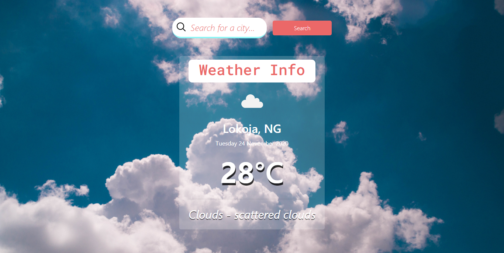

# README

 

# This Project is Restaurant app build using JavaScript to render the page. It is a simple weather app which displays the weather details of places.

> In this project, i built a `Weather` app following the [OdinProject](https://www.theodinproject.com/courses/javascript/lessons/weather-app) specification. 

## Project Description

The project is initialized by running `npm install webpack webpack-cli --save-dev` to install webpack to the node_modules directory of your project.
A `src and dist` is created in the directory with the following contents:
- index.js file in src.
- index.html file in dist. 
- main.js is by generated by webpack when you run `npm run build`.
- A `webpack.common.js` is created to do the basic configurations.
- An HTML skeleton inside of `dist/index.html` file.

Bare-bones html is created for the application. Javascript is used to manipulate the DOM.
functions that hit the API are created. The functions take a location and return the weather data for that location..

Next, is the functions that process the JSON data we’re getting from the API and return an object with only the data  required for your app.

A simple form that will let users input their location and will fetch the weather info is created and dispaly the information on the webpage!.
A ‘loading’ component that displays from the time the form is submitted until the information comes back from the API is created.

## 

## Built With

- JavaScript ES6
- HTML
- CSS
- Bootstrap
- WebPack bundler

## Prerequisities

To get this project up and running locally, you must have  yarn, npm and node installed on your computer.

## Getting Started

**To get this project set up on your local machine, follow these simple steps:**

**Step 1** 
Navigate through the local folder where you want to clone the repository and run
`git clone https://github.com/uimarshall/weather-app`. 

**Step 2** 
`cd weather-app`. 

**Step 3** 
Run `npm install` to install the packages from the `package.json`. 

**Step 4** 
Run `npm start` to open the application in a browser of your choice. 

**Step 5** 
You can navigate to `http://localhost:8080/` to see your application running 

## Authors

👤 **Marshall Akpan**

- Github: [uimarshall](https://github.com/uimarshall)
- Twitter: [uimarshall](https://twitter.com/uimarshall)
- Linkedin: [Marshall Akpan](https://www.linkedin.com/in/marshall-akpan-19745526/)

## 🤝 Contributing

Our favourite contributions are those that help us improve the project, whether with a contribution, an issue, or a feature request!

Feel free to check the [issues page](https://github.com/uimarshall/weather-app/issues) to either create an issue or help us out by fixing an existing one.

## Show your support

If you've read this far....give a ⭐️!

## :clap: Acknowledgements

- Microverse
- OdinProject

## 📝 License

This project is licensed by Microverse and the Odin Project

- ...
